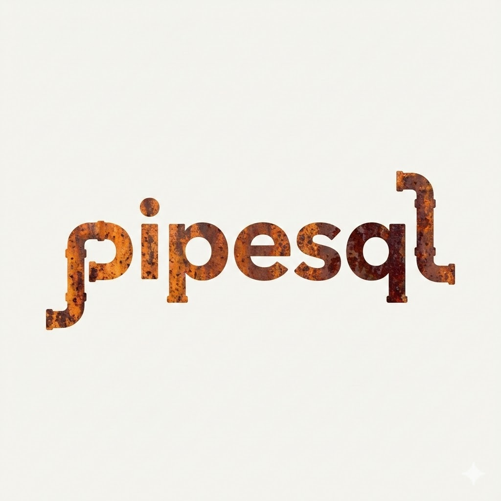
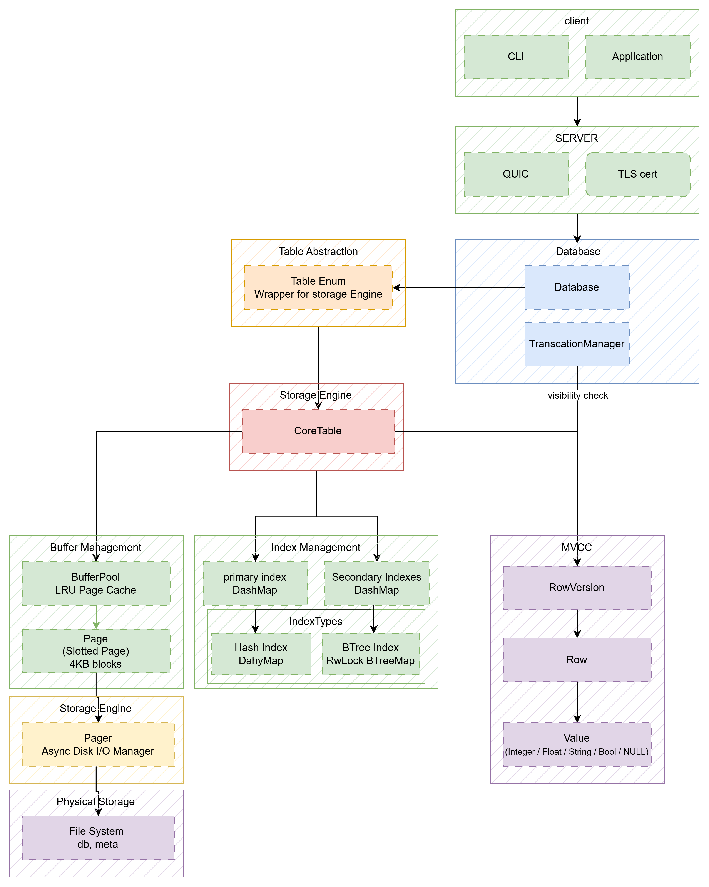

# PipeSQL

> 🚀**A lightweight relational database management system in Rust with QUIC protocol support**

## overview 📚

### Background

| Probelm | Traditional SQL DBMS | PipeSQL |
|---------|----------------------|---------|
| TCP Overhead | Mysql, PostgreSQL | QUIC(mutliplexing)
| Performance degradation due to Lock contention |Traditional DBMS | Lock-free Structures(DashMap) 
| Read/Write Blocking | simple DB | MVCC | 
| Complex Configuration | Mysql, PostgreSQL | Zero-Config |

### Definition

 PipeSQL is a high-performance, in-memory SQL database based on the QUIC protocol.

 * More powerful queries than Redis
 * Simpler configuration than MySQL/PostgreSQL
 * Better concurrency than SQLite

### GOOD Case

* Real-time analytics
* state store for microservices
* Seesion Management (Redis Alternative)
* prototype development
* Edge computing applications

### architecture

## contributing 🖐️

Contributions are welcome! Please read the [contributing guidelines](CONTRIBUTING.md) before submitting a pull request.